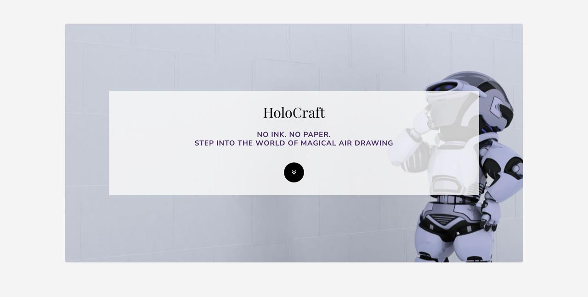
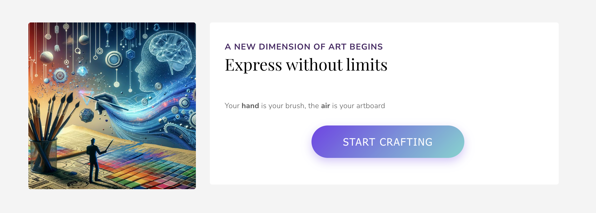

# 曲睿艺术网站 - 空中绘画网页应用

  

## 概述
一个完全基于网页的应用，让您仅使用手和摄像头就能在空中绘画。

## 功能

### 控制模式
- **绘画模式**：捏合拇指和食指 👌
- **擦除模式**：显示和平手势 ✌️
- **改变颜色**：向上指向 👆

### 视觉界面
- 全屏绘画区域
- 实时手部跟踪显示
- 带光标反馈的颜色选择器

## 工作原理
1. **跟踪**您的手部使用MediaPipe（21个地标）
2. **实时识别**您的手势
3. **平滑移动**（使用0.36平滑因子实现流畅绘画）
4. **将移动转换为**数字艺术

## 项目结构

### 着陆页 (`index.html` + 模板资源)
一个静态页面，仅用于视觉展示项目。它不包含任何绘画或手势逻辑。

### 核心绘画应用
- `app.js` → 所有手势识别和绘画逻辑
- `app.html` → 带有画布和视频流的实际绘画界面。
- `app.css` → 绘画环境的样式。

  
## 设置
1. 克隆仓库
2. 在Chrome/Firefox中打开 `index.html`
3. 点击"开始创作"
    

   

4. 允许摄像头访问

> **注意：** 等待几秒钟检测您的手部地标。
> 当准备就绪时，您会在屏幕上看到手部地标出现。

5. 开始在空中绘画！

